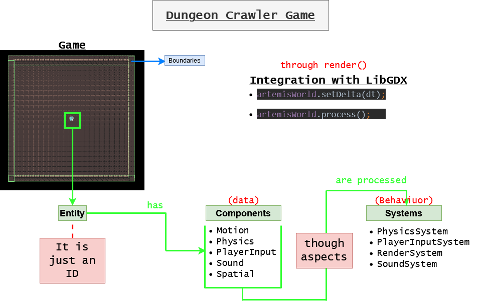

# DungeonCrawlerGameTutorial

A Simple project, that tries to be an entry point for those willing to understand Artemis-odb in conjunction with LibGDX. The same is based on the following [post](https://github.com/junkdog/artemis-odb/wiki/Introduction-to-Entity-Systems)

## Libraries used
* [LibGDX](https://libgdx.badlogicgames.com/) (Extensions Box2D)
* [Artemis-odb](https://github.com/junkdog/artemis-odb)

## Snapshot picture of the project

